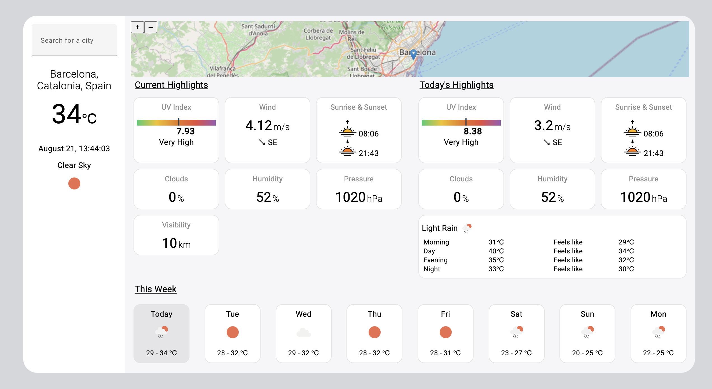
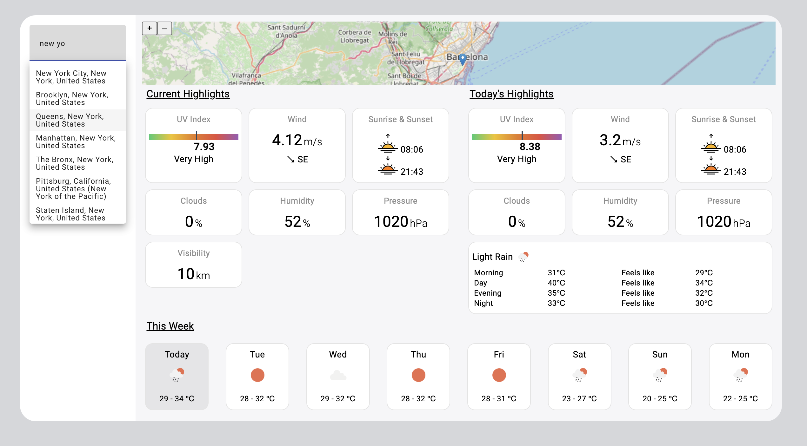

# WeatherApp

- uses geo.geosurf.io to get user ip details, no API key required
- uses api.openweathermap.org to get weather details, API key is mandatory
- uses api.teleport.org to search city, no API key required

Installation
1. npm install
2. npm run start
3. Open the project locally and provide the OpenWeatherMap API key. The link should have apikey query parameter: http://localhost:4200/?apikey=YOUR_API_KEY

TODO:
- show previously loaded (cached) cities in dropdown
- show city image if exist (teleport API)
- unit tests

